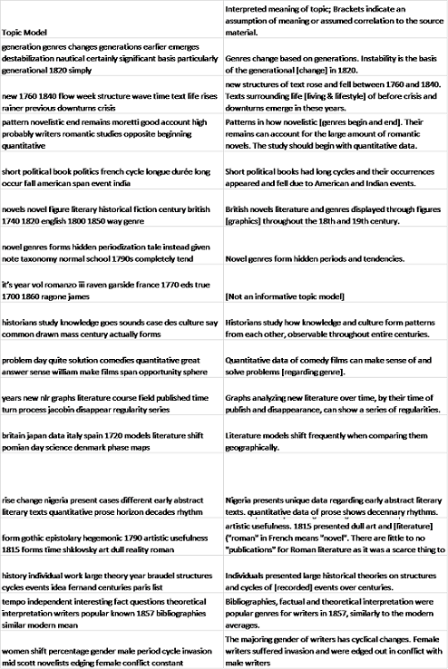

This where I put the text of the blog

Digital Humanities

I believe that making use of topic modelling software and the resulting graphics and charts and claiming it is in the spirit of interactivity or fresh perspectives on data visualisations is wildly naive and trivializes the arguments of Moretti and Drucker.

